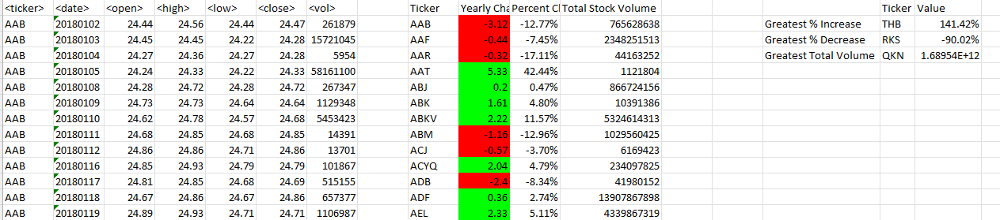

# VBA Automation for Annual Stock Metrics
### Contributor: Lan "Alice" Nguye

### Overview
This challenge involves utilizing VBA scripting to conduct a comprehensive analysis of stock market data spanning one year. The dataset is housed in an Excel workbook, containing over 700,000 rows of stock information for a diverse set of 3000 stock symbols.

### Analysis Steps
A script has been developed to iterate through all stocks over the course of a year, generating key insights such as:
- Ticker symbol identification
- Yearly change, calculated from the opening price at the beginning of the year to the closing price at the end of that year
- Percentage change from the opening to the closing price
- Total stock volume

Additional functionality has been incorporated into the script to identify stocks with the "Greatest % Increase," "Greatest % Decrease," and "Greatest Total Volume."

### Results
The script's output serves as a comprehensive summary of the annual price fluctuations and trading volumes for each stock. This information facilitates a quick assessment of the best and worst-performing stocks throughout the year. Moreover, the same codebase can effortlessly analyze data from different years with a simple click of a button, enhancing its versatility and ease of use.